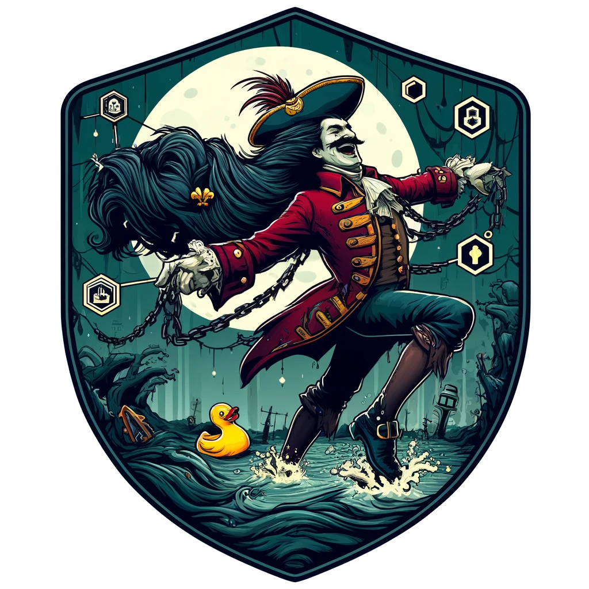

# InsideOut Ethberlin - Self-DA & Storage zkrollup toy model

InsideOut is a toy model of rollup (yes, this is a rollup, not validium), demonstrating, how a rollup could be maintained on the blockchain without publishing the data anywhere outside the rollup.

We use techniques inspired by the file blockchain solutions (like Filecoin, Arweave, Ethstorage, etc), but wrap all processes into a zk rollup.

In this way, we reach the following property:

1. The rollup can store its own blocks and additional data inside itself, like a baron Munchausen, who pulls himself out of the swamp by his own hair!

2. Potentially this technique can be used to build a multi-layered infastructure of recursive rollups and transform Web2 into Web3.

## What is inside the repo

* Solidity smart contract
* Noir zkSNARK circuit
* Node
* Storage client, who can store the data and mine the blocks
* User client. You can upload small images inside the rollup and view them

## Limitations

This is a toy model built for the ETHBerlin hackathon. It is not production-ready and has a lot of limitations, security issues, and bugs. You will not find any optimizations, high performance, security, or any other features, that are necessary for a production-ready system. It should be used for educational purposes only.

## Deploying the services
1. Replace all VIRTUAL_HOST and LETSENCRYPT_HOST with your domain name.
2. Replace the PUBLIC_ROLLUP_API_URL and the PUBLIC_NODE_API_URL args of the client-app with your domain name.
3. Run `docker-compose up -d` to deploy the services.

## Deploying the contract
TODO

